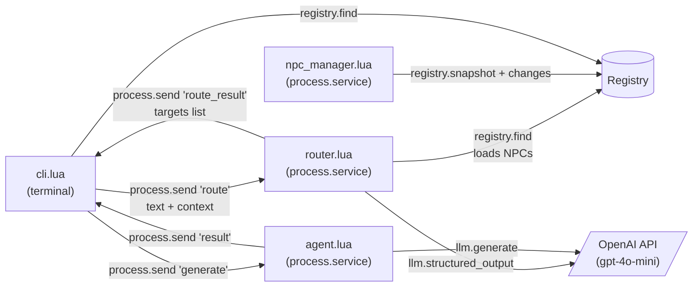
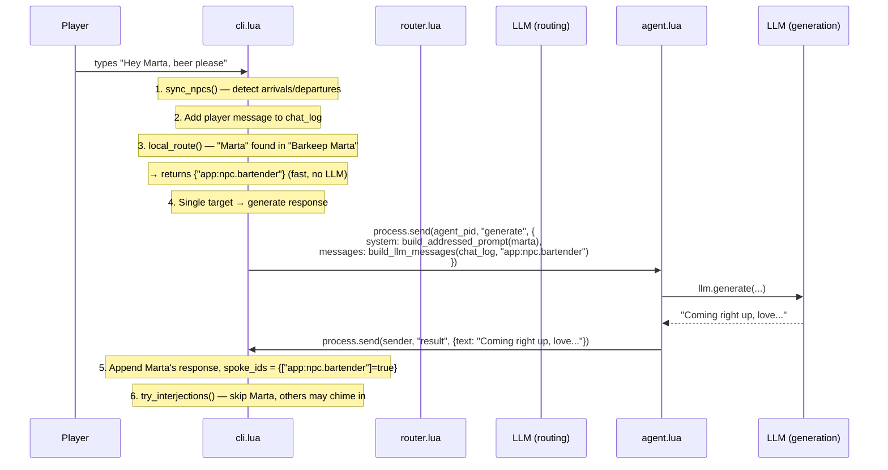
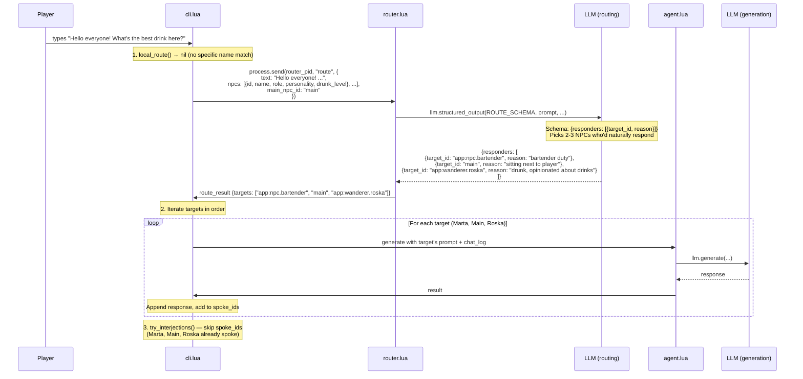
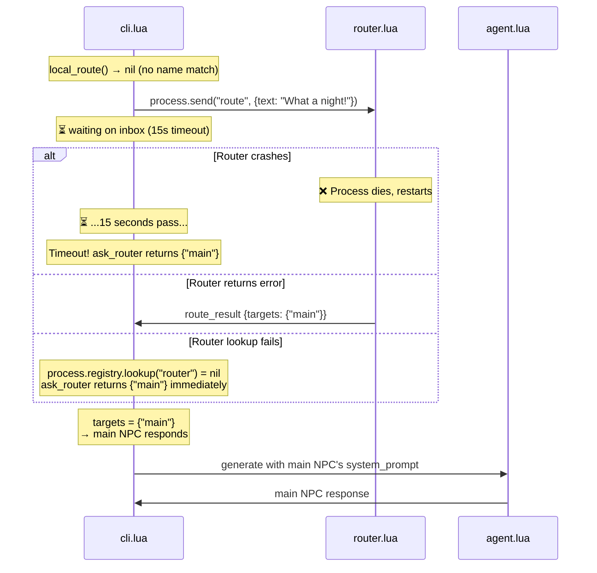
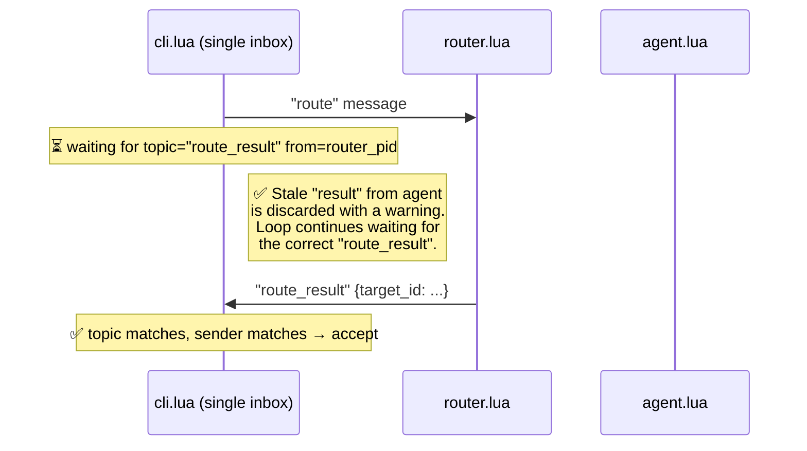
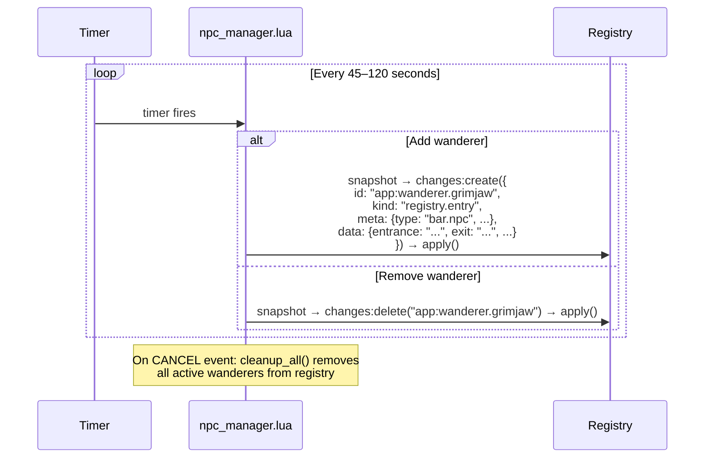

# Conversation Flow — The Rusty Flagon

## Process Architecture



## Message Flow: Player Types Something



## Message Flow: Group Addressing



## Failure Scenario: Router Fails → Main NPC Responds



## Key Concern: Shared Inbox — FIXED

The CLI process uses a single inbox for communication with both the router and the agent.
Both `ask_router()` and `ask_agent()` now **loop with topic + sender filtering**, discarding
stale messages from the wrong service.



### Additional fixes applied:
- **System messages prefixed with `[Narrator]:`** — `build_llm_messages` now marks
  arrival/departure events distinctly so the LLM doesn't confuse narration with player speech.
- **Main patron can interject** — When a registry NPC is directly addressed, the main patron
  (the person you're sitting next to) now has a 25% chance to chime in, making conversations
  feel more natural.
- **Sender validation** — Both `ask_agent` and `ask_router` verify `msg:from()` matches
  the expected service PID, not just the topic.

## NPC Manager (background, independent)



## Diagnosis: Router Issues — Status

| # | Issue | Status | Notes |
|---|---|---|---|
| 1 | `llm.structured_output` panics (wrong args?) | ⚠️ Mitigated | Local name-match in CLI bypasses the LLM router for obvious cases. Router crash only affects ambiguous messages. |
| 2 | `llm.structured_output` doesn't exist in runtime | ⚠️ Mitigated | Same — local routing handles most cases without needing the router process at all. |
| 3 | Shared inbox picks up stale message | ✅ Fixed | `ask_router` and `ask_agent` now loop, filtering by topic AND sender PID. |
| 4 | Router not registered when CLI starts | ✅ Fixed | Local name-match runs first, no dependency on router process. LLM fallback logs a warning if router isn't found. |
| 5 | Structured output returns name instead of ID | ✅ Fixed | Router now does fuzzy matching — if LLM returns "Marta", "Barkeep Marta", "bartender", or "npc.bartender", it resolves to `app:npc.bartender`. |
| 6 | Strict ID validation silently drops correct results | ✅ Fixed | Was the root cause. Router validation was exact-match only (`answer == npc.id`). LLM routinely returned names/roles instead of full qualified IDs like `app:npc.bartender`, causing every message to default to main patron. |
| 7 | System messages confuse LLM responses | ✅ Fixed | Arrival/departure narration now prefixed with `[Narrator]:` in `build_llm_messages`. |
| 8 | Main patron can't interject when others speak | ✅ Fixed | `try_interjections` now gives the main patron a 25% chance to chime in when a registry NPC is directly addressed. |

### Routing Architecture

```
Player says "Marta, beer please!"
│
├─► local_route() — name match: "Marta" ∈ "Barkeep Marta"
│   Returns: {"app:npc.bartender"} (instant, no LLM)
│
└─► (skipped)

Player says "Beer please" (no name)
│
├─► local_route() — ORDER_KEYWORDS: "beer" → find_bartender()
│   Returns: {"app:npc.bartender"} (instant, no LLM)
│
└─► (skipped)

Player says "berer please" (typo, no keyword match)
│
├─► local_route() — no match → nil
│
└─► LLM router (reads NPCs from registry, sees conversation context)
    Context: [Barkeep Marta]: "how about I pour you a small one?"
    → LLM infers continuation → {"app:npc.bartender"}

Player says "Hello everyone!"
│
├─► local_route() — no match → nil
│
└─► LLM router (multi-target)
    → {"app:npc.bartender", "main", "app:wanderer.roska"}
    → Each responds in order, then interjections from the rest

Player says "yes" / "tell me more" (continuation)
│
├─► local_route() — no match → nil
│
└─► LLM router sees recent context → routes to whoever was just talking
```

## Remaining Design Concerns

| # | Concern | Impact | Suggested Fix |
|---|---|---|---|
| 1 | **Unbounded chat_log** | LLM context window overflow on long conversations; ever-growing render time | Add a sliding window (e.g. keep last 30 messages for LLM, full log for display) |
| 2 | **No CANCEL handling in CLI** | Process can't shut down gracefully; must be force-killed | Add `process.events()` monitoring in the input loop (requires non-blocking input or a select with events channel) |
| 3 | **ID style mismatch** | Main patron uses bare `"main"` while registry NPCs use `"app:npc.bartender"` format. The LLM might not treat `"main"` as a proper ID | Use a more distinctive ID like `"patron_main"` or `"player_companion"` |
| 4 | **Sequential interjections** | Multiple interjecting NPCs cause sequential LLM calls, each blocking 2-10s | Accept for now; parallel calls would require managing multiple outstanding agent requests |
| 5 | **Startup timing fragility** | 1s sleep before first registry load may miss slow-starting services | Use retry loop with backoff for initial `process.registry.lookup` calls |
